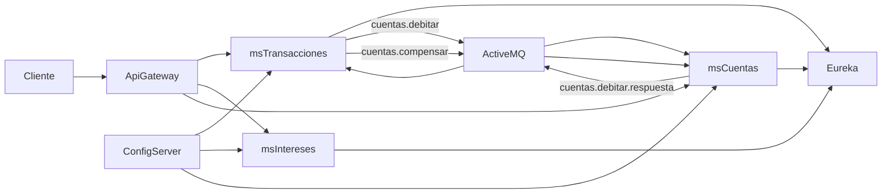

# Banco XYZ — PBY2203 Experiencia 3
## Semana 5 (BFF), Semana 6 (Spring Cloud) y Semana 7 (eventos JMS)

Este repositorio continúa el Banco XYZ. La semana 5 expone un BFF por canal. Las semanas 6 y 7 agregan un ecosistema Spring Cloud local y una saga de retiros por JMS. No hace falta AWS: la configuración vive en `config-repo/` y el broker ActiveMQ arranca embebido en `ms-transacciones`.

## Objetivo

Implementar el patrón **Backend for Frontend (BFF)** para el Banco XYZ, creando backends personalizados para tres canales (Web, Móvil y Cajeros), con autenticación/autorización por canal y seguridad HTTPS.

Los datos se obtienen desde el legado [bank_legacy_data](https://github.com/KariVillagran/bank_legacy_data), previamente migrados a H2 por el proyecto batch.

## Estructura de la entrega

```
.
├── README.md
├── pom.xml                   # Reactor Spring Cloud (semanas 6 y 7)
├── config-repo/              # YAML que publica el Config Server
├── config-server/            # Puerto 8888
├── eureka-server/            # Puerto 8761
├── api-gateway/              # Puerto 8080, HTTP Basic y rutas
├── ms-transacciones/         # Puerto 8081, orquestador JMS
├── ms-intereses/             # Puerto 8082
├── ms-cuentas/               # Puerto 8083, participante de la saga
├── evidencias/
├── xyz/                      # Spring Batch: CSV -> H2
└── xyz-bff/                  # BFF HTTPS de la semana 5
```

## Separación de responsabilidades

| Proyecto | Rol |
|----------|-----|
| `xyz` | Solo **Spring Batch**: migra CSV → H2. No expone APIs BFF. |
| `xyz-bff` | Solo **BFF**: APIs HTTPS por canal. No ejecuta jobs batch. |

Ambos comparten la misma base H2 en archivo: `xyz/data/bankxyz`.

---

## Proyecto `xyz` (Batch)

### Qué hace
- Lee CSV de transacciones, intereses y estados de cuenta.
- Valida/normaliza con ItemProcessors.
- Aplica Skip/Retry/BackOff.
- Persiste en H2 para que el BFF consulte.

### Cómo ejecutar
```bash
cd xyz
.\mvnw.cmd -DskipTests spring-boot:run
```
La app es non-web y termina al finalizar los jobs.

### Estructura relevante
```
xyz/src/main/java/com/banco/xyz/
├── XyzApplication.java
├── batch/          # jobs, processors, policies, listeners
└── domain/
```

---

## Proyecto `xyz-bff` (Semana 5)

### Estrategia BFF elegida
Se eligió **backends/endpoints personalizados por tipo de cliente**:

- Equipo pequeño → un proyecto BFF, con canales separados.
- Cada frontend tiene necesidades distintas (payload completo vs liviano vs operaciones críticas).
- Facilita mantenimiento y extensión sin tres repositorios independientes.

### Canales

| Canal | Prefijo | Usuario | Password | Rol | Características |
|-------|---------|---------|----------|-----|-----------------|
| Web | `/bff/web/**` | `web` | `web123` | `CHANNEL_WEB` | Respuestas completas |
| Móvil | `/bff/mobile/**` | `mobile` | `mobile123` | `CHANNEL_MOBILE` | Respuestas livianas |
| ATM | `/bff/atm/**` | `atm` | `atm123` | `CHANNEL_ATM` | Saldo/retiro + PIN por cuenta |

### Endpoints

**Web**
- `GET /bff/web/dashboard`
- `GET /bff/web/transacciones`
- `GET /bff/web/intereses`
- `GET /bff/web/cuentas/{id}/estado-anual`

**Móvil**
- `GET /bff/mobile/home?limit=5`
- `GET /bff/mobile/cuentas` → solo `id`, `saldo`, `tipo`
- `GET /bff/mobile/cuentas/{id}/resumen`

**ATM**
- `GET /bff/atm/ping`
- `GET /bff/atm/saldo/{id}` + header `X-ATM-PIN`
- `POST /bff/atm/retiro` + header `X-ATM-PIN`

`{id}` = PK técnica de `cuentas_con_interes`.

### Seguridad
- **HTTPS** en puerto `8443` (keystore PKCS12 en `xyz-bff/src/main/resources/keystore/`).
- **Autenticación** HTTP Basic por canal.
- **Autorización** por rol (un canal no puede llamar a otro → 403).
- **PIN ATM** validado **por cuenta** (no PIN fijo global).  
  Regla de prueba: `PIN = últimos 4 dígitos de cuentaId` (ej. `cuentaId=106` → `0106`).

### DTOs tipados
Las respuestas usan records tipados por canal (no `Map` genéricos).

### Estructura relevante
```
xyz-bff/src/main/java/com/banco/xyz/bff/
├── XyzBffApplication.java
├── web/WebBffController.java
├── mobile/MobileBffController.java
├── atm/AtmBffController.java
├── security/BffSecurityConfig.java
├── security/AtmPinService.java
└── service/BankDataQueryService.java
```

### Cómo ejecutar
```bash
# 1) Primero cargar datos con batch
cd xyz
.\mvnw.cmd -DskipTests spring-boot:run

# 2) Luego levantar BFF
cd ../xyz-bff
.\mvnw.cmd -DskipTests spring-boot:run
```
Base URL: `https://localhost:8443`

### Ejemplos curl
```bash
# Web
curl -k -u web:web123 https://localhost:8443/bff/web/dashboard

# Mobile
curl -k -u mobile:mobile123 "https://localhost:8443/bff/mobile/home?limit=3"

# ATM (id=1, cuentaId=106 → PIN 0106)
curl -k -u atm:atm123 -H "X-ATM-PIN: 0106" https://localhost:8443/bff/atm/saldo/1

# Cross-channel (debe responder 403)
curl -k -u web:web123 https://localhost:8443/bff/mobile/home
```
`-k` se usa porque el certificado es autofirmado (entorno local/académico).

---

## Evidencias

Carpeta `evidencias/`:

| Archivo | Contenido |
|---------|-----------|
| `evidencia_bff.txt` | Ejecución HTTPS de Web/Móvil/ATM, PIN inválido (401), cross-channel (403) |
| `evidencia_batch_resumen.txt` | Resumen del batch como soporte de datos |
| `evidencia_s6_config_server.txt` | Config Server entregando la config de un microservicio |
| `evidencia_s6_eureka.txt` | Tres microservicios registrados |
| `evidencia_s6_auth.txt` | 401 sin credenciales, 200 con rol y 403 por autorización |
| `evidencia_s6_resilience.txt` | Circuit breaker OPEN y respuesta FALLBACK |
| `evidencia_s7_saga_jms.txt` | Retiro confirmado, duplicado ignorado y compensación |

---

## Requisitos

- Java 17+
- Maven Wrapper en la raíz (`mvnw.cmd`) y en `xyz` / `xyz-bff`

---

## Semanas 6 y 7 — microservicios, seguridad y eventos

### Arquitectura elegida

Saga por **orquestación** con **JMS (ActiveMQ embebido)**. El retiro cruza dos servicios: `ms-transacciones` coordina y `ms-cuentas` aplica el débito. JMS encaja en ese flujo punto a punto y no requiere Docker ni un cluster de Kafka. Cada mensaje lleva un `eventId`. Si el mismo débito llega dos veces, `ms-cuentas` lo ignora. Si el débito se aplicó y el orquestador simula un fallo posterior, publica una compensación.



Colas y mensajes:

| Cola | Quién publica | Quién consume | Mensaje |
|------|----------------|---------------|---------|
| `cuentas.debitar` | ms-transacciones | ms-cuentas | `DEBIT;eventId;cuentaId;monto;` |
| `cuentas.debitar.respuesta` | ms-cuentas | ms-transacciones | `RESULT;eventId;0;saldo;OK` o `REJECT:...` o `COMPENSATED` |
| `cuentas.compensar` | ms-transacciones | ms-cuentas | `COMPENSATE;eventId;cuentaId;monto;` |

`cuentaId` es la PK técnica de `cuentas_con_interes`, la misma que usa el BFF.

### Cómo ejecutar

Desde la raíz del repositorio, después de compilar con `.\mvnw.cmd -DskipTests package`:

```powershell
# 1) Cargar H2
cd xyz
.\mvnw.cmd -DskipTests spring-boot:run
cd ..

# 2) Plataforma y microservicios, en este orden
java -jar config-server\target\config-server-0.0.1-SNAPSHOT.jar
java -jar eureka-server\target\eureka-server-0.0.1-SNAPSHOT.jar
java -jar ms-transacciones\target\ms-transacciones-0.0.1-SNAPSHOT.jar
java -jar ms-intereses\target\ms-intereses-0.0.1-SNAPSHOT.jar
java -jar ms-cuentas\target\ms-cuentas-0.0.1-SNAPSHOT.jar
java -jar api-gateway\target\api-gateway-0.0.1-SNAPSHOT.jar
```

Espera a que cada proceso imprima que arrancó antes de lanzar el siguiente. `ms-transacciones` abre el broker en `tcp://127.0.0.1:61616`. Los tres microservicios leen su puerto, la base H2 y los umbrales de Resilience4j desde el Config Server.

### Usuarios

| Usuario | Password | Puede |
|---------|----------|--------|
| `web` | `web123` | GET de los tres servicios. No puede retirar. |
| `mobile` | `mobile123` | GET de los tres servicios. |
| `atm` | `atm123` | GET y POST de retiros. |

### Ejemplos

```powershell
# Config centralizada
curl.exe http://localhost:8888/ms-transacciones/default

# Eureka
curl.exe http://localhost:8761/eureka/apps

# 401, 200 y 403
curl.exe -i http://localhost:8080/transacciones
curl.exe -i -u web:web123 http://localhost:8080/transacciones/origen-config
curl.exe -i -u web:web123 -H "Content-Type: application/json" -d "{\"cuentaId\":1,\"monto\":10}" http://localhost:8080/transacciones/retiros

# Retiro confirmado (ATM). cuentaId = id de /intereses/cuentas
curl.exe -u atm:atm123 -H "Content-Type: application/json" -d "{\"cuentaId\":1,\"monto\":10}" http://localhost:8080/transacciones/retiros

# Duplicado ignorado y compensación
curl.exe -u atm:atm123 -H "Content-Type: application/json" -d "{\"cuentaId\":1,\"monto\":10,\"simularDuplicado\":true}" http://localhost:8080/transacciones/retiros
curl.exe -u atm:atm123 -H "Content-Type: application/json" -d "{\"cuentaId\":1,\"monto\":10,\"simularFallo\":true}" http://localhost:8080/transacciones/retiros

# Circuit breaker: detener ms-cuentas y consultar
curl.exe -u web:web123 http://localhost:8080/transacciones/salud-dependencia
```

El POST del retiro responde `202` con estado `PENDIENTE`. Un GET posterior a `/transacciones/retiros/{id}` muestra `CONFIRMADO`, `RECHAZADO` o `COMPENSADO`.

Para ver la cola repartir carga, se puede levantar una segunda instancia de `ms-cuentas` en otro puerto (`java -jar ... --server.port=8084`). Ambas consumen `cuentas.debitar`. La evidencia está en `evidencias/evidencia_s7_saga_jms.txt`.
